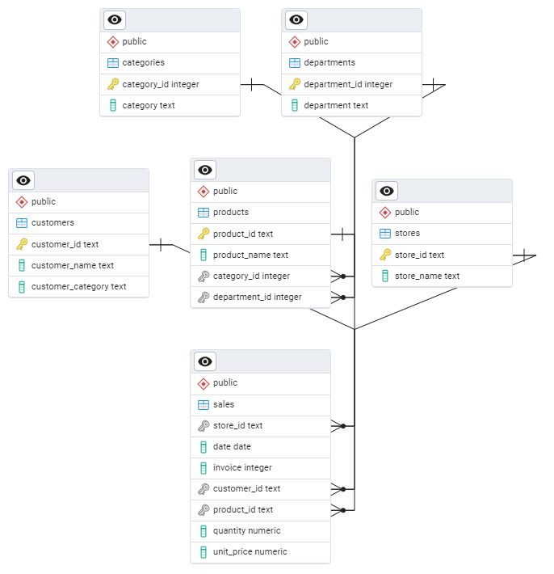

# Supermarket Sales Analysis

## 📄 Project Overview

This project focuses on analyzing the sales performance of a supermarket chain by creating a PostgreSQL database to store and process sales data. The data was imported from pre-cleaned CSV files. The analysis offers insights into the store's sales patterns, top-performing departments, and seasonal trends.

## 🗂 Database Schema

The database schema includes tables for:
- **📂 Categories**: Contains details of product categories.
- **🏢 Departments**: Represents the various departments in the supermarket.
- **📦 Products**: Stores information on the products sold in the store.
- **👥 Customers**: Details about the customers.
- **🏬 Stores**: Information on each store in the chain.
- **🧾 Sales**: Records of all sales transactions, including details such as store, date, invoice, customer, product, quantity, and unit price.

## 📊 Key Insights

1. **🏆 Top Departments**: Out of 21 departments, only **10 contribute to 80% of the supermarket's total revenue**, highlighting the importance of certain departments in driving sales. Efforts should be made to avoid stockouts in the snacks, beverages, personal care, and pantry departments. The product ranges in these categories can be further expanded.

2. **🏅 Best-Performing Store**: The **Vizula** store stands out as the top performer, generating 64% of the total sales across all stores. Commercial and marketing efforts should be focused on the other three stores to increase their revenue.

3. **📈 Seasonal Trends**:
   - Generally, the highest sales occur in the last quarter of the year.
   - However, the **Vizula** store showed a different trend, achieving its peak sales during **January, May, June, and July**.

## 🏁 Conclusion

This analysis provides a comprehensive view of the supermarket's sales dynamics, highlighting key departments, top stores, and seasonal trends. These insights can guide management in making data-driven decisions to optimize performance across the chain.
